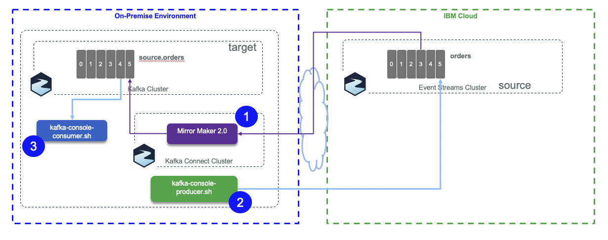

# Mirror Maker 2.0

The `mirror-maker-2` folder includes the scripts and configurations to support the different tests

## From Strimzi kafka cluster on Openshift cluster to local cluster



The source cluster is a Strimzi cluster running on Openshift as a service on IBM Cloud. It was installed following the instructions [documented here](https://ibm-cloud-architecture.github.io/refarch-eda/deployments/strimzi/deploy/).

The target cluster is also based on Strimzi kafka 2.4 docker image, but run in a local host, with docker compose. It starts two zookeeper nodes, and three kafka nodes. We need 3 kafka brokers as mirror maker created topics with a replication factor set to 3.

* Start the target cluster runnning on your laptop using:

```
docker-compose up
```

* Start [mirror maker2.0](https://cwiki.apache.org/confluence/display/KAFKA/KIP-382%3A+MirrorMaker+2.0): 

    By using a new container, start another kakfa 2.4+ docker container, connected to the  brokers via the `kafkanet` network, and mounting the configuration in the `/home`:

    ```shell
    docker run -ti --network kafkanet -v $(pwd):/home strimzi/kafka:latest-kafka-2.4.0 bash
    ```

    Inside this container starts mirror maker 2.0 using the script: `/opt/kakfa/bin/connect-mirror-maker.sh`

    ```shell
    /opt/kakfa/bin/connect-mirror-maker.sh /home/strimzi-mm2.properties
    ```

    The `strimzi-mm2.properties` properties file given as argument defines the source and target clusters and the topics to replicate:

    ```properties
    clusters=source, target
    source.bootstrap.servers=my-cluster-kafka-bootstrap-jb-kafka-strimzi.gse-eda-demos-fa9ee67c9ab6a7791435450358e564cc-0001.us-east.containers.appdomain.cloud:443
    source.security.protocol=SSL
    source.ssl.truststore.password=password
    source.ssl.truststore.location=/home/truststore.jks
    target.bootstrap.servers=kafka1:9092,kafka2:9093,kafka3:9094
    # enable and configure individual replication flows
    source->target.enabled=true
    source->target.topics=orders
    ```

    As the source cluster is deployed on Openshift, the exposed route to access the brokers is using TLS connection. So we need the certificate and create a truststore to be used by those Java programs. All kafka tools are done in java or scala so running in a JVM, which needs truststore for keep trusted TLS certificates. To get the certificate do the following steps:

    1. Get the host ip address from the Route resource

        ```shell
        oc get routes my-cluster-kafka-bootstrap -o=jsonpath='{.status.ingress[0].host}{"\n"}'
        ```

    1. Get the TLS certificate from the broker

        ```shell
        oc get secrets
        oc extract secret/my-cluster-cluster-ca-cert --keys=ca.crt --to=- > ca.crt
        ```

    1. Transform the certificate fo java truststore

        ```shell
        keytool -import -trustcacerts -alias root -file ca.crt -keystore truststore.jks -storepass password -noprompt
        ```


* The consumer may be started in second or third step. To start it, you can use a new container or use one of the running kafka broker container. Using the `Docker perspective` in Visual Code, we can get into a bash shell within one of the Kafka broker container. The local folder is mounted to `/home`. Then the script, `consumeFromLocal.sh source.orders` will get messages from the replicated topic: `source.orders`

* Finally start the producer in another kafka broker shell

```shell
/home/produceToStrimzi.sh orders
```

## From Event Streams to local cluster

For the second tests the source is Event Streams on IBM Cloud:


This time the producer adds headers and message and Mirror maker need to get the APIkey, so the mirror-maker.properties looks like:

```properties
clusters=source, target
source.bootstrap.servers=broker-3-qnprtqnp7hnkssdz.kafka.svc01.us-east.eventstreams.cloud.ibm.com:9093,broker-1-qnprtqnp7hnkssdz.kafka.svc01.us-east.eventstreams.cloud.ibm.com:9093,broker-0-qnprtqnp7hnkssdz.kafka.svc01.us-east.eventstreams.cloud.ibm.com:9093,broker-5-qnprtqnp7hnkssdz.kafka.svc01.us-east.eventstreams.cloud.ibm.com:9093,broker-2-qnprtqnp7hnkssdz.kafka.svc01.us-east.eventstreams.cloud.ibm.com:9093,broker-4-qnprtqnp7hnkssdz.kafka.svc01.us-east.eventstreams.cloud.ibm.com:9093
source.security.protocol=SASL_SSL
source.ssl.protocol=TLSv1.2
source.sasl.mechanism=PLAIN
source.sasl.jaas.config=org.apache.kafka.common.security.plain.PlainLoginModule required username="token" password="985...";
target.bootstrap.servers=kafka1:9092,kafka2:9093,kafka3:9094
# enable and configure individual replication flows
source->target.enabled=true
source->target.topics=orders
```

The figure below illustrates the mirror maker internal components running in Kafka Connect. 


On the the target cluster, mirror maker created the following topics:

* connect-configs: This topic will store the connector and task configurations.
* connect-offsets: This topic is used to store offsets for Kafka Connect.
* connect-status: This topic will store status updates of connectors and tasks.